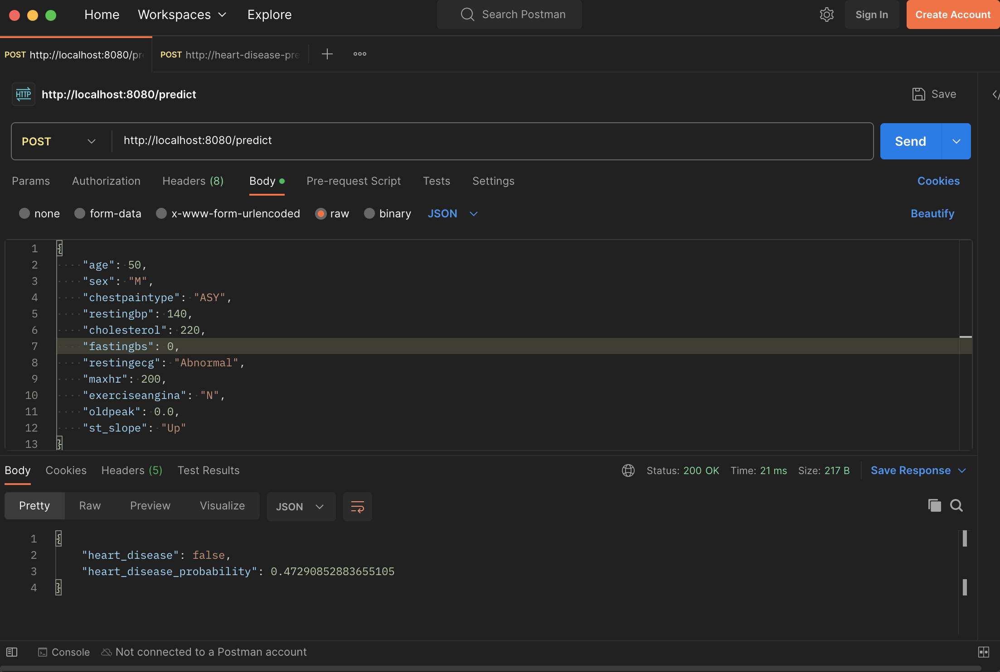
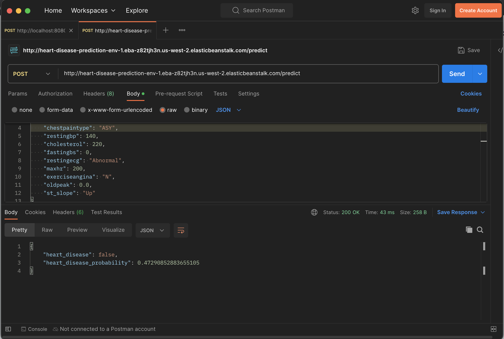

# Heart disease prediction

## Problem statement

This is the midterm project for DataTalksClub's Machine Learning Zoomcamp. The model I am training and dpeloying is the [Heart Failure prediction dataset](https://www.kaggle.com/datasets/fedesoriano/heart-failure-prediction) from Kaggle. The hypothesis is that we can predict whether or not someone has heart failure based on various clinical measurements, such as cholesterol, whether the patient has diabetes, etc. I thought this was an interesting dataset because I was diagnosed with gestational diabetes and did a little bit of research to understand the long-term effects, like on the heart.

As part of this project, I have a prepared a notebook to do exploratory data analysis, train several models, and select the model with the best performance. I have also created a Flask API that deploys the model as a web service.

## Important files in this project

* `notebook.ipynb`: the notebook containing the data analysis and model training
* `train.py`: the Python script to train the selected model with the tuned parameters
* `model_random_forest.bin`: the selected model with the tuned parameters, pickled using Python's `pickle` library
* `predict.py`: the Python code that bootstraps the Flask API for receiving heart failure prediction requests and performing predictions against the model
* `data/`: the directory containing the heart failure data CSV file, which I downloaded from Kaggle
* `Dockerfile`: the Dockerfile to containerize the Flask API
* `Pipfile*`: pip-related dependencies
 

# How to run the model API

## Install dependencies

Prerequisites: Python 3.10+, `pipenv`

Install pip dependencies
```
pipenv install
```

If you want to run the notebook, you'll also want to install the dev dependencies
```
pipenv install --dev
```

## Jupyter notebook

The notebook contains the data cleaning, analysis, and model training.

To run the notebook:
```
pipenv run jupyter notebook
```

## Run server locally

The trained model can be deployed in a web service (a Flask API). To start the server:

```
pipenv run gunicorn --bind 0.0.0.0:8080 predict:app
```

## Sending test data to server

The next step is to send data to the server. The server expects an HTTP `POST`` request with JSON data.

Possible values for the data, from the Kaggle dataset description:

* age: age of the patient [years]
* sex: sex of the patient [M: Male, F: Female]
* chestpaintype: chest pain type [TA: Typical Angina, ATA: Atypical Angina, NAP: Non-Anginal Pain, ASY: Asymptomatic]
* restingbp: resting blood pressure [mm Hg]
* cholesterol: serum cholesterol [mm/dl]
* fastingbs: fasting blood sugar [1: if FastingBS > 120 mg/dl, 0: otherwise]
* restingecg: resting electrocardiogram results [Normal: Normal, ST: having ST-T wave abnormality (T wave inversions and/or ST elevation or depression of > 0.05 mV), LVH: showing probable or definite left ventricular hypertrophy by Estes' criteria]
* maxhr: maximum heart rate achieved [Numeric value between 60 and 202]
* exerciseangina: exercise-induced angina [Y: Yes, N: No]
* oldpeak: oldpeak = ST [Numeric value measured in depression]
* st_slope: the slope of the peak exercise ST segment [Up: upsloping, Flat: flat, Down: downsloping]


### Sample data

```json
{
    "age": 50,
    "sex": "M",
    "chestpaintype": "ASY",
    "restingbp": 140,
    "cholesterol": 220,
    "fastingbs": 0,
    "restingecg": "Abnormal",
    "maxhr": 200,
    "exerciseangina": "N",
    "oldpeak": 0.0,
    "st_slope": "Up"
}
```

### Using postman

You can use [Postman](https://www.postman.com/downloads/) to send requests to the API.



### Using curl

If you prefer to issue requests via commandline, you can use `curl`.

```
curl -X 'POST' http://localhost:8080/predict -H 'Content-Type: application/json' -d '{
    "age": 50,
    "sex": "M",
    "chestpaintype": "ASY",
    "restingbp": 140,
    "cholesterol": 220,
    "fastingbs": 0,
    "restingecg": "Abnormal",
    "maxhr": 200,
    "exerciseangina": "N",
    "oldpeak": 0.0,
    "st_slope": "Up"
}'
```

## Docker

Docker makes it easy to deploy the API and model because the application and its dependencies can be packaged up and deployed.

Build the Docker image:
```
docker build -t heart-disease .
```

Run the Docker container:
```
docker run -it -p 8080:8080 heart-disease:latest
```

You can issue requests directly to server running in the Docker container. See [Sending test data to server](#sending-test-data-to-server) section for an example request.

## Cloud deployment

I've deployed the model to AWS Elastic Beanstalk. You can send prediction requests (`POST`) to [this endpoint](http://heart-disease-prediction-env-1.eba-z82tjh3n.us-west-2.elasticbeanstalk.com/predict).

### Using postman


### Using curl
```
curl -X 'POST' http://heart-disease-prediction-env-1.eba-z82tjh3n.us-west-2.elasticbeanstalk.com/predict -H 'Content-Type: application/json' -d '{
    "age": 50,
    "sex": "M",
    "chestpaintype": "ASY",
    "restingbp": 140,
    "cholesterol": 220,
    "fastingbs": 0,
    "restingecg": "Abnormal",
    "maxhr": 200,
    "exerciseangina": "N",
    "oldpeak": 0.0,
    "st_slope": "Up"
}'
```

Response:
```json
{"heart_disease":false,"heart_disease_probability":0.47290852883655105}
```